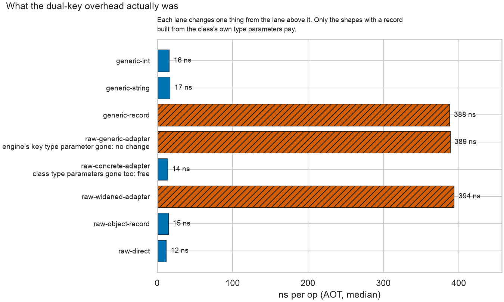

# Benchmarks

Maintainer tooling, excluded from the published tarball. Three lanes live here:

- **Key-codec matrix** (`bench.dart` + `driver.sh`, plus `driver_1m.sh` for the open-only 1M
  pass): measures put / putAll / open / get / scan / query / RSS / file size per key-encoding
  scheme (arithmetic packed int, String composite, 0.0.x bit-shift reference) at 1K/10K/100K.
- **Wrapper-overhead lane** (`overhead_bench.dart` + `overhead_driver.sh`): façade vs raw hive_ce,
  fourteen lanes across `KeyedBox` / `LazyKeyedBox` (get, values, contains, put, putAll, delete,
  deleteAll) and `SingleValueBox` / `LazySingleValueBox` (get, set); the aim-#4 proof. The target
  is two-currency (tens of ns per op on memory paths, single-digit percent on disk paths) because a
  flat percentage is meaningless on the cheap lanes; see below. The eager read path carries
  `vm:prefer-inline` pragmas exactly because this lane holds it to raw speed.
- **List-box lane** (`list_box_bench.dart` + `list_box_driver.sh`): `ListBox` against two
  hand-rolled baselines, across two element types and the elements-per-key axis.

Only operations with an **exact** raw counterpart live in the overhead lane, so its percentages
mean "what the wrapper costs" and nothing else. `ListBox` and `DualKeyBox` are deliberately
out: raw hive_ce has no list-valued or two-part-keyed box, so their baseline has to be hand-rolled
code rather than one call. That is a different question, asked in the matrix lane (dual) and in the
list-box lane.

## The list-box lane's two baselines

"Versus raw hive_ce" isn't one question here, because raw hive_ce has no list-valued box. The
baseline is code a consumer writes, and there are two versions of it:

| impl | what it does |
|---|---|
| `naive` | `box.get(k) as List<T>`, `box.put(k, list)`. What you write first |
| `correct` | plus `.cast<T>()` on read and a defensive `List.of` on write. What you write after being bitten |
| `facade` | `ListBox` |

`facade` vs `correct` prices the wrapper. `facade` vs `naive` prices **safety**. Reporting one
without the other answers the wrong question.

### Whether `naive` is broken depends on the element type

Probed against hive_ce 2.19.3, and this is narrower than `ListBox`'s own docs used to claim:

- **`List<String>`** reads back from disk as `List<String>`. The engine specialises lists of
  primitives, so the naive cast survives a restart and hand-rolling is genuinely fine.
- **`List<Person>`** (adapter-registered custom type) reads back as `List<dynamic>`, so the naive
  cast throws `TypeError` on the first post-restart read. That is upstream #150, pinned in
  [`collection_disk_truth_test.dart`](../test/integration/hive_ce_pins/collection_disk_truth_test.dart),
  and the reason the box exists.

So the lane runs both element types, and the read lanes record the throw as the result instead of
dying on it: "this baseline cannot read its own data back" is the measurement. It lands on exactly
one of the two axes.

### Watch the seeding

`add` and `remove` seed a box before timing, and the seed must build **a distinct list per key in
every impl**. Raw hive_ce will happily store one list instance under 200 keys; the façade's `putAll`
materialises a private copy per key. Seed them differently and the RSS column reports that setup
difference as a wrapper cost, which is exactly the false 2x this lane produced on its first run
before the seeding was equalised and the RSS window moved after the seed.

> **The overhead lane needs a quiet host.** It resolves tens of nanoseconds per op, so background
> load doesn't add noise, it drowns the signal. Passes taken on a laptop with two JetBrains IDEs
> running (load average 4 to 17) put eager get anywhere from -6% to +27% and spread individual
> samples 27x apart; the same lane on the same machine at load 3 reads +1.5%, reproducibly.
> `python/overhead.py` cross-checks median against min and refuses to stand behind a run where they
> diverge. Read its verdict before quoting any number from this lane.

### Percentages lie on cheap operations

Some ops here are so cheap that one extra call frame is a double-digit percentage. A same-slot
`SingleValueBox.get` costs ~13 ns raw, so the façade's `Option` allocation and codec dispatch take
it to ~24 ns: **+89%**, and also +11 ns. Walking an eager `values` iterable is +32% and +3 ns.

Neither is a performance problem, and quoting either percentage would be a lie by arithmetic. So
`overhead.py` prints a per-op nanosecond column and, below `CHEAP_OP_NS`, says outright that the
percentage is a fact about the denominator.

The list-box lane has the same hazard from the other direction: its `get` ratio runs 3.0x at one
element per key and 1.1x at a thousand, which reads like the wrapper getting cheaper at scale. It
isn't. Fitting the four lengths gives **~292 ns fixed per get + ~1.8 ns per element** (within 8% at
every length), so both terms are real and the ratio only moves because the fixed term stops
dominating. Quote the two-term model, never the ratio at one list length.

That fixed term is an SDK regression, not a wrapper change, and it is one of only two cross-version
claims here that survive a controlled check. Compiling this lane's source with both 3.12.2 and
3.13.1 and alternating the binaries on one host, seven interleaved rounds at one element per key,
puts the façade at 310 ns per get against 390 by min (345 against 430 by median) while `correct`
goes 140 to 125 and `naive` stays inside its own spread. Measured as the wrapper's own cost over
`correct`, that is **+170 ns growing to +265 ns, up 56%**. 3.12.2 fitted the lane at ~197 ns + ~1.6
ns per element; the per-element term is not pinned down at `reps 5`, two passes putting it at 1.8
and 2.5.

The mechanism is not identified, and it is not in the obvious places. Isolated on the same two SDKs,
the cast view's construction, iterating it through the extra `UnmodifiableListView` layer, the
engine's type argument (`Engine<T>` against `Engine<List<T>>`), and fpdart's `Option` in the real
box path all come out *faster* on 3.13.1 or flat, and `KeyedBox` reads do not move at all. So the
cost is emergent in the whole compiled `getOr` chain rather than in any one component, and the next
step is disassembly or VM profiling, not another black-box probe. Those five are ruled out; do not
spend the afternoon re-testing them.

Do not read the same story into the other lanes. The matrix lane's eager get looks 40% worse than
its 2026-07-26 file, but the same alternating check puts the two SDKs within 2% of each other
today, well inside one SDK's own 27% sample spread. That lane is slower because this host is, not
because the compiler is. Comparing a lane against an older results file measures the host as much
as the SDK, so only a two-binary pass on one host settles a version question.

The overhead lane's two readings sort its own lanes cleanly:

- **memory-path ops** (eager get, contains, values, batch writes): 1 to 22 ns of wrapper per op;
- **effectful ops** (anything returning a `Task` that hits disk): 300 to 660 ns per op, which is
  `Task` construction plus `.run()` plus the engine's guard, and lands at 2 to 3% against a
  disk read of tens of microseconds.

Quote nanoseconds for the first group and percentages for the second.

### How precise is this lane, really

Two full passes at comparable load (3.3 to 4.8) reproduce the ordering and the bands, not the
individual figures. Per-op wrapper cost, run A then run B:

| Lane | A | B |
|---|---|---|
| values (eager) | +3 ns | +2 ns |
| single get (eager) | +11 ns | +7 ns |
| get (eager) | +10 ns | +16 ns |
| contains (lazy) | +45 ns | +10 ns |
| delete | +311 ns | +337 ns |
| single set (eager) | +410 ns | +378 ns |
| put | +393 ns | +789 ns |
| single get (lazy) | +657 ns | +684 ns |
| get (lazy) | -62 ns | +452 ns |

So: the two groups above are solid, and most lanes land within a factor of two. `put` and
`get (lazy)` are not: they moved 2x and flipped sign respectively, and `put` tripped the 5% target
in B while clearing it in A. Treat any single figure from this lane as an order of magnitude, and
don't quote a lane to two significant figures without a third pass agreeing.

## The `impl` axis

Every matrix lane runs twice, once per `impl`:

- `facade` drives the shipped `DualKeyBox` / `LazyDualKeyBox` through the shipped
  `PackedIntDualCodec` / `StringCompositeDualCodec`. **These are the numbers the top-level
  README's performance table quotes.**
- `raw` drives `hive_ce` directly with the hand-inlined pack/unpack in `key_codecs.dart`. It is
  the historical baseline (this lane started life as the pre-1.0 planning study, which only ever
  measured raw) and the denominator for the matrix lane's overhead percentages.

The driver preps one box file per (keyKind, scale) and points both impls at it. That works only
because the shipped codecs encode byte-identically to `key_codecs.dart`; keep them that way or
the two impls quietly stop comparing like with like.

`bitshift` is raw-only. No shipped codec packs that way, because `PackedIntDualCodec` is
byte-identical to it for in-range parts (which is what lets 0.0.x boxes read in place), so a
façade lane there would just re-measure `arith`.

Two scan modes, deliberately:

- `scan` reads nothing, only decodes every live key and counts primary matches. Raw-only, kept
  verbatim so the pre-1.0 result rows stay comparable.
- `scanread` scans *and* reads every match, which is what `queryByPrimary` actually does. This is
  the mode with a façade counterpart, so it is the one to compare.

## Running the overhead lane

```sh
dart compile exe benchmark/overhead_bench.dart -o /tmp/hbm_overhead
benchmark/overhead_driver.sh /tmp/hbm_overhead benchmark/results/results_overhead.jsonl 9
```

Then derive the percentages the top-level README quotes, rather than hand-computing them:

```sh
uv run --project benchmark/python python overhead.py
```

It prints both medians per lane, the per-op delta, and flags anything at or over the 5% target.

## Running the list-box lane

```sh
dart compile exe benchmark/list_box_bench.dart -o /tmp/hbm_list_box
benchmark/list_box_driver.sh /tmp/hbm_list_box benchmark/results/results_list_box.jsonl 5
uv run --project benchmark/python python list_box.py
```

## Running the key-shape lane

```sh
dart compile exe benchmark/key_shape_bench.dart -o /tmp/hbm_key_shape
benchmark/key_shape_driver.sh /tmp/hbm_key_shape benchmark/results/results_key_shape.jsonl 7
uv run --project benchmark/python python key_shape.py   # every claim must print HOLDS
```

The reader prints the table, checks each claim, and writes
[`reports/key_shape_attribution.png`](reports/key_shape_attribution.png):



AOT only; a JIT pass answers a different question, since the effect is an AOT subtype-check path.
This lane touches no disk and prepares no box: the store is an in-process Map, because the question
is a type shape rather than a storage cost.

It exists because #14's root cause was wrong in three documents for a release, having been read off
a table where one lane moved two variables at once. So the reader states each relationship as a
claim and checks it, and the `PREMISE` line fails loudly if a future SDK starts caching the subtype
check this whole argument rests on. Numbers alone would let the same mistake happen twice.

3.13.1 moved this lane, and it is the cleanest reading of that SDK's cost change anywhere in the
suite: the three record-paying lanes went up 6 to 10% (`generic-record` 355 to 388 ns) while every
free lane got 1 to 4% *faster*. The free lanes are the control, so this is the compiler, not the
host, and a two-binary alternating pass on one host reproduces it. The shipped shape (`raw-direct`)
is in the group that got faster.

## Running the matrix

```sh
# Quick JIT sanity pass (ordering only; not for decisions). The scales are explicit: this lane
# deliberately stops at 10K, and driver.sh would otherwise default in the 100K scale.
benchmark/driver.sh benchmark/bench_jit.sh benchmark/results/results_jit.jsonl 3 "1000 10000"

# AOT pass (the numbers that decide anything). reps 9, not driver.sh's default 5.
dart compile exe benchmark/bench.dart -o /tmp/hbm_bench
benchmark/driver.sh /tmp/hbm_bench benchmark/results/results_aot.jsonl 9

# 1M open-only pass, same executable:
benchmark/driver_1m.sh /tmp/hbm_bench benchmark/results/results_1m.jsonl
```

Each invocation is one fresh process per measurement; the driver writes one JSON line per run.

## `results/`

Raw JSONL backing the top-level README's performance tables and codec-crossover guidance:

| File | Lane |
|---|---|
| `results_aot.jsonl` | matrix, AOT: the numbers that decide anything |
| `results_1m.jsonl` | matrix, 1M open-only |
| `results_jit.jsonl` | matrix, JIT: ordering sanity, never for decisions |
| `results_overhead.jsonl` | wrapper overhead, AOT: the source of the README's percentages |
| `results_list_box.jsonl` | list-box lane, AOT: three impls x two element types x list length |
| `results_key_shape.jsonl` | key-shape lane, AOT: which type shape costs what, with its controls |

Environment for all of them: macOS 15.7.8 on Apple Silicon (arm64), Dart 3.13.1, hive_ce 2.19.3,
2026-08-21, all six re-run in one session. Values were a constant 1 byte by design, isolating key
cost; web performance is unmeasured (ordering assumed to follow the VM).

`results_overhead.jsonl` carries a load stamp, but see the precision note above before quoting a
single figure from it: a repeat pass moved `put` 2x and flipped `get (lazy)`'s sign. The 3.13.1
pass reproduced that and worse. Two passes ten minutes apart, same binary, flipped the sign on four
lanes (`contains (eager)`, `get (lazy)`, `single get (lazy)`, `deleteAll`), moved `single set
(eager)` 2x, and each printed CONTAMINATED on a different lazy lane. The file below is one of those
passes, kept because its load stamp matches the 3.12.2 pass most closely; treat it as unresolved,
not as percentages. Re-run before anything from this lane lands in the top-level README:

```sh
dart compile exe benchmark/overhead_bench.dart -o /tmp/hbm_overhead
benchmark/overhead_driver.sh /tmp/hbm_overhead benchmark/results/results_overhead.jsonl 9
uv run --project benchmark/python python overhead.py   # must not print CONTAMINATED
```

This lane also carries `putallby`, which does **not** go through the wrapper-overhead machinery: its
impl axis is `map` vs `facade` (the two ways to write one call) rather than `raw` vs `facade`, since
there is no raw hive_ce counterpart. It is also the one lane that times the caller's batch
construction, because removing that map is the entire point of `putAllBy`; every other write lane
treats the batch as given input. It gets its own `by_n` (6th driver argument, default 100000): one
batched call is cheap at that size, and a few-percent effect does not clear rep noise at `put_n`,
where each op is a disk round-trip and 100K would be unaffordable.

Re-stamp this section whenever the results are regenerated, and commit the JSONL in the same
change as any number that cites it. A percentage with no committed data behind it is not a
measurement, it is a memory of one: the overhead lane spent 1.0 in exactly that state, with a
harness in the tree and its output nowhere.

## `reports/`

Charts rendered from `results/` and committed as PNGs. Four come from
[`python/plot.py`](python/plot.py) and are referenced by the top-level README by absolute raw
GitHub URL, so they render on pub.dev without shipping in the tarball (`benchmark/` is
`.pubignore`d): codec get + keystore-RSS scaling (packed vs String), and open time + per-read
latency (eager vs lazy). The fifth, `key_shape_attribution.png`, comes from
[`python/key_shape.py`](python/key_shape.py) and is referenced the same way, from the top-level
README's composite-key note. Built with seaborn
over matplotlib, data in polars (seaborn reads polars frames directly via the dataframe
interchange protocol), matching the sibling packages' chart style. Colours are the Okabe-Ito
CVD-safe pair, with line style and marker as a second cue so identity never rests on colour alone.

The Python lives in [`python/`](python/) as a [`uv`](https://docs.astral.sh/uv/) project
(`pyproject.toml` + committed `uv.lock` + `.python-version`), so nothing installs onto your machine
globally. Regenerate whenever the results change:

```sh
uv sync --project benchmark/python                    # create .venv, install the pinned stack
uv run --project benchmark/python python plot.py      # rewrite reports/*.png
uv run --project benchmark/python python overhead.py  # print the overhead table
```

[`overhead.py`](python/overhead.py) prints rather than plots (three lanes make a table, not a
chart), so it leans on the stdlib instead of the charting stack.
